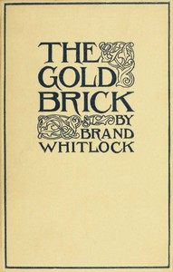

# The Gold Brick <kbd>67596</kbd>

## Authors

 - Whitlock, Brand <small>(1869 - 1934)</small>

## Subjects

 - Political fiction
 - Short stories, American
 - United States -- Politics and government -- Fiction

## Download

 - https://www.gutenberg.org/ebooks/67596.txt.utf-8
 - https://www.gutenberg.org/ebooks/67596.kindle.images
 - https://www.gutenberg.org/ebooks/67596.rdf
 - https://www.gutenberg.org/cache/epub/67596/pg67596.cover.medium.jpg
 - https://www.gutenberg.org/files/67596/67596-h.zip
 - https://www.gutenberg.org/ebooks/67596.epub.images
 - https://www.gutenberg.org/files/67596/67596-0.txt
 - https://www.gutenberg.org/files/67596/67596-h/67596-h.htm

## Book Shelves

