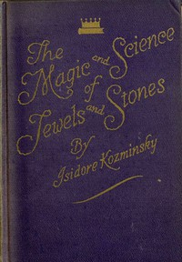

# The Magic and Science of Jewels and Stones <kbd>57980</kbd>

## Authors

 - Kozminsky, Isidore <small>(1870 - null)</small>

## Subjects

 - Gems -- Miscellanea
 - Occultism -- Miscellanea
 - Precious stones -- Psychic aspects

## Download

 - https://www.gutenberg.org/files/57980/57980-0.zip
 - https://www.gutenberg.org/cache/epub/57980/pg57980.cover.small.jpg
 - https://www.gutenberg.org/files/57980/57980-0.txt
 - https://www.gutenberg.org/ebooks/57980.html.images
 - https://www.gutenberg.org/files/57980/57980-h/57980-h.htm
 - https://www.gutenberg.org/ebooks/57980.kindle.images
 - https://www.gutenberg.org/ebooks/57980.epub.images
 - https://www.gutenberg.org/ebooks/57980.rdf

## Book Shelves

