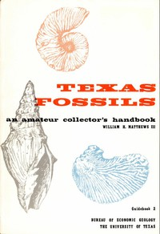

# Texas Fossils: An Amateur Collector's Handbook <kbd>56315</kbd>

## Authors

 - Matthews, William Henry <small>(1919 - null)</small>

## Subjects

 - Paleontology -- Texas

## Download

 - https://www.gutenberg.org/files/56315/56315-h.zip
 - https://www.gutenberg.org/ebooks/56315.html.images
 - https://www.gutenberg.org/cache/epub/56315/pg56315.cover.medium.jpg
 - https://www.gutenberg.org/files/56315/56315-0.txt
 - https://www.gutenberg.org/ebooks/56315.rdf
 - https://www.gutenberg.org/ebooks/56315.epub.images
 - https://www.gutenberg.org/ebooks/56315.kindle.images

## Book Shelves

