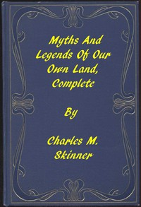

# Myths and Legends of Our Own Land — Complete <kbd>6615</kbd>

## Authors

 - Skinner, Charles M. (Charles Montgomery) <small>(1852 - 1907)</small>

## Subjects

 - Folklore -- United States

## Download

 - https://www.gutenberg.org/files/6615/6615-0.zip
 - https://www.gutenberg.org/files/6615/6615-h/6615-h.htm
 - https://www.gutenberg.org/files/6615/6615.txt
 - https://www.gutenberg.org/cache/epub/6615/pg6615.cover.small.jpg
 - https://www.gutenberg.org/files/6615/6615-0.txt
 - https://www.gutenberg.org/ebooks/6615.html.images
 - https://www.gutenberg.org/ebooks/6615.kindle.images
 - https://www.gutenberg.org/ebooks/6615.rdf
 - https://www.gutenberg.org/ebooks/6615.epub.images

## Book Shelves

 - Folklore
