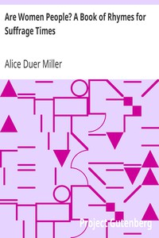

# Are Women People? A Book of Rhymes for Suffrage Times <kbd>11689</kbd>

## Authors

 - Miller, Alice Duer <small>(1874 - 1942)</small>

## Subjects

 - Women -- Suffrage -- Poetry

## Download

 - https://www.gutenberg.org/cache/epub/11689/pg11689.cover.small.jpg
 - https://www.gutenberg.org/files/11689/11689.txt
 - https://www.gutenberg.org/files/11689/11689.zip
 - https://www.gutenberg.org/ebooks/11689.html.images
 - https://www.gutenberg.org/files/11689/11689-8.txt
 - https://www.gutenberg.org/ebooks/11689.txt.utf-8
 - https://www.gutenberg.org/ebooks/11689.epub.images
 - https://www.gutenberg.org/ebooks/11689.rdf
 - https://www.gutenberg.org/files/11689/11689-h/11689-h.htm
 - https://www.gutenberg.org/ebooks/11689.kindle.images

## Book Shelves

 - Suffrage
