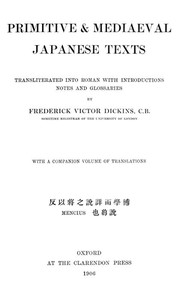

# Primitive & Mediaeval Japanese Texts: Transliterated into Roman with introductions, notes and glossaries <kbd>53295</kbd>

## Authors

## Subjects

 - Japanese literature -- To 1868

## Download

 - https://www.gutenberg.org/cache/epub/53295/pg53295.cover.medium.jpg
 - https://www.gutenberg.org/files/53295/53295-h.zip
 - https://www.gutenberg.org/files/53295/53295-h/53295-h.htm
 - https://www.gutenberg.org/ebooks/53295.html.images
 - https://www.gutenberg.org/files/53295/53295-0.txt
 - https://www.gutenberg.org/ebooks/53295.rdf
 - https://www.gutenberg.org/ebooks/53295.kindle.images
 - https://www.gutenberg.org/ebooks/53295.epub.images

## Book Shelves

