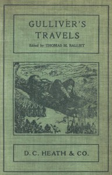

# Gulliver's Travels into Several Remote Regions of the World <kbd>17157</kbd>

## Authors

 - Swift, Jonathan <small>(1667 - 1745)</small>

## Subjects

 - Fantasy fiction
 - Gulliver, Lemuel (Fictitious character) -- Fiction
 - Satire
 - Travelers -- Fiction
 - Voyages, Imaginary -- Early works to 1800

## Download

 - https://www.gutenberg.org/files/17157/17157-h/17157-h.htm
 - https://www.gutenberg.org/cache/epub/17157/pg17157.cover.small.jpg
 - https://www.gutenberg.org/files/17157/17157-h.zip
 - https://www.gutenberg.org/files/17157/17157-0.zip
 - https://www.gutenberg.org/ebooks/17157.txt.utf-8
 - https://www.gutenberg.org/files/17157/17157-0.txt
 - https://www.gutenberg.org/ebooks/17157.epub.images
 - https://www.gutenberg.org/ebooks/17157.rdf
 - https://www.gutenberg.org/ebooks/17157.kindle.images

## Book Shelves

