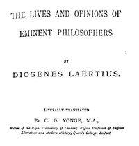

# The Lives and Opinions of Eminent Philosophers <kbd>57342</kbd>

## Authors

 - Diogenes Laertius <small>(null - null)</small>

## Subjects

 - Philosophers, Ancient -- Biography
 - Philosophy, Ancient

## Download

 - https://www.gutenberg.org/cache/epub/57342/pg57342.cover.medium.jpg
 - https://www.gutenberg.org/files/57342/57342-h.zip
 - https://www.gutenberg.org/ebooks/57342.html.images
 - https://www.gutenberg.org/files/57342/57342-h/57342-h.htm
 - https://www.gutenberg.org/files/57342/57342-0.txt
 - https://www.gutenberg.org/ebooks/57342.epub.images
 - https://www.gutenberg.org/ebooks/57342.rdf
 - https://www.gutenberg.org/ebooks/57342.kindle.images

## Book Shelves

