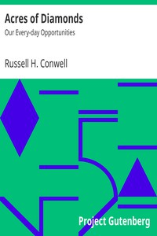

# Acres of Diamonds: Our Every-day Opportunities <kbd>368</kbd>

## Authors

 - Conwell, Russell H. <small>(1843 - 1925)</small>

## Subjects

 - Conwell, Russell H., 1843-1925
 - Success
 - Temple University

## Download

 - https://www.gutenberg.org/files/368/368-0.zip
 - https://www.gutenberg.org/files/368/368-8.txt
 - https://www.gutenberg.org/files/368/368-h/368-h.htm
 - https://www.gutenberg.org/files/368/368.zip
 - https://www.gutenberg.org/cache/epub/368/pg368.cover.medium.jpg
 - https://www.gutenberg.org/files/368/368-0.txt
 - https://www.gutenberg.org/ebooks/368.html.images
 - https://www.gutenberg.org/ebooks/368.kindle.images
 - https://www.gutenberg.org/ebooks/368.rdf
 - https://www.gutenberg.org/ebooks/368.epub.images

## Book Shelves

