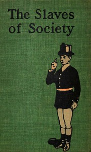

# The Slaves of Society: A Comedy in Covers <kbd>67606</kbd>

## Authors

 - Upward, Allen <small>(1863 - 1926)</small>

## Subjects

 - England -- Social life and customs -- Fiction
 - Satire

## Download

 - https://www.gutenberg.org/ebooks/67606.rdf
 - https://www.gutenberg.org/cache/epub/67606/pg67606.cover.small.jpg
 - https://www.gutenberg.org/ebooks/67606.kindle.images
 - https://www.gutenberg.org/ebooks/67606.txt.utf-8
 - https://www.gutenberg.org/ebooks/67606.epub.images
 - https://www.gutenberg.org/files/67606/67606-0.txt
 - https://www.gutenberg.org/files/67606/67606-0.zip
 - https://www.gutenberg.org/files/67606/67606-h/67606-h.htm

## Book Shelves

