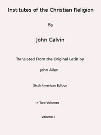

# Institutes of the Christian Religion (Vol. 1 of 2) <kbd>45001</kbd>

## Authors

 - Calvin, Jean <small>(1509 - 1564)</small>

## Subjects

 - Reformed Church -- Doctrines -- Early works to 1800
 - Theology, Doctrinal -- Early works to 1800

## Download

 - https://www.gutenberg.org/files/45001/45001-h/45001-h.html
 - https://www.gutenberg.org/files/45001/45001-tei.zip
 - https://www.gutenberg.org/files/45001/45001-0.zip
 - https://www.gutenberg.org/files/45001/45001-pdf.zip
 - https://www.gutenberg.org/cache/epub/45001/pg45001.cover.medium.jpg
 - https://www.gutenberg.org/files/45001/45001-8.txt
 - https://www.gutenberg.org/ebooks/45001.html.images
 - https://www.gutenberg.org/ebooks/45001.kindle.images
 - https://www.gutenberg.org/ebooks/45001.rdf
 - https://www.gutenberg.org/ebooks/45001.epub.images
 - https://www.gutenberg.org/files/45001/45001-tei/45001-tei.tei
 - https://www.gutenberg.org/files/45001/45001-pdf.pdf

## Book Shelves

