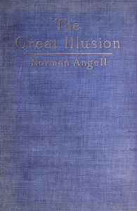

# The Great Illusion: A Study of the Relation of Military Power to National Advantage <kbd>38535</kbd>

## Authors

 - Angell, Norman <small>(1874 - 1967)</small>

## Subjects

 - Commercial policy
 - Disarmament
 - Imperialism
 - War
 - War, Cost of

## Download

 - https://www.gutenberg.org/files/38535/38535-h/38535-h.htm
 - https://www.gutenberg.org/files/38535/38535-8.zip
 - https://www.gutenberg.org/files/38535/38535-8.txt
 - https://www.gutenberg.org/files/38535/38535.txt
 - https://www.gutenberg.org/cache/epub/38535/pg38535.cover.medium.jpg
 - https://www.gutenberg.org/ebooks/38535.html.images
 - https://www.gutenberg.org/ebooks/38535.txt.utf-8
 - https://www.gutenberg.org/ebooks/38535.rdf
 - https://www.gutenberg.org/ebooks/38535.kindle.images
 - https://www.gutenberg.org/ebooks/38535.epub.images

## Book Shelves

