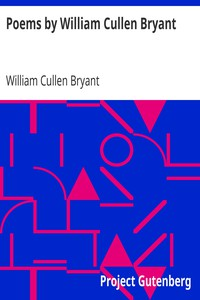

# Poems by William Cullen Bryant <kbd>16341</kbd>

## Authors

 - Bryant, William Cullen <small>(1794 - 1878)</small>

## Subjects

 - American poetry -- 19th century

## Download

 - https://www.gutenberg.org/files/16341/16341-8.zip
 - https://www.gutenberg.org/files/16341/16341-8.txt
 - https://www.gutenberg.org/files/16341/16341-h/16341-h.htm
 - https://www.gutenberg.org/cache/epub/16341/pg16341.cover.medium.jpg
 - https://www.gutenberg.org/ebooks/16341.html.images
 - https://www.gutenberg.org/files/16341/16341.txt
 - https://www.gutenberg.org/ebooks/16341.txt.utf-8
 - https://www.gutenberg.org/ebooks/16341.epub.images
 - https://www.gutenberg.org/ebooks/16341.rdf
 - https://www.gutenberg.org/ebooks/16341.kindle.images

## Book Shelves

