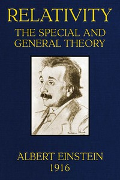

# Relativity : the Special and General Theory <kbd>5001</kbd>

## Authors

 - Einstein, Albert <small>(1879 - 1955)</small>

## Subjects

 - Relativity (Physics)

## Download

 - https://www.gutenberg.org/files/5001/5001-h/5001-h.htm
 - https://www.gutenberg.org/cache/epub/5001/pg5001.cover.small.jpg
 - https://www.gutenberg.org/ebooks/5001.epub.images
 - https://www.gutenberg.org/files/5001/5001-h.zip
 - https://www.gutenberg.org/ebooks/5001.kindle.images
 - https://www.gutenberg.org/ebooks/5001.rdf

## Book Shelves

 - Physics
