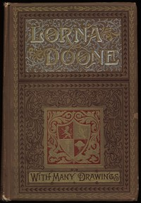

# Lorna Doone: A Romance of Exmoor <kbd>17460</kbd>

## Authors

 - Blackmore, R. D. (Richard Doddridge) <small>(1825 - 1900)</small>

## Subjects

 - Exmoor (England) -- Fiction
 - Historical fiction
 - Love stories
 - Monmouth's Rebellion, 1685 -- Fiction

## Download

 - https://www.gutenberg.org/files/17460/17460-0.txt
 - https://www.gutenberg.org/files/17460/17460.zip
 - https://www.gutenberg.org/files/17460/17460-8.zip
 - https://www.gutenberg.org/files/17460/17460-h/17460-h.htm
 - https://www.gutenberg.org/cache/epub/17460/pg17460.cover.medium.jpg
 - https://www.gutenberg.org/ebooks/17460.html.images
 - https://www.gutenberg.org/files/17460/17460-8.txt
 - https://www.gutenberg.org/ebooks/17460.epub.images
 - https://www.gutenberg.org/ebooks/17460.rdf
 - https://www.gutenberg.org/ebooks/17460.kindle.images

## Book Shelves

