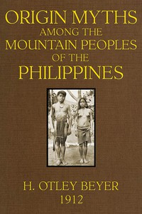

# Origin Myths among the Mountain Peoples of the Philippines <kbd>46024</kbd>

## Authors

 - Beyer, H. Otley (Henry Otley) <small>(1883 - 1966)</small>

## Subjects

 - Creation
 - Ifugao (Philippine people) -- Religion
 - Mythology, Philippine

## Download

 - https://www.gutenberg.org/files/46024/46024-h/46024-h.htm
 - https://www.gutenberg.org/files/46024/46024-h.zip
 - https://www.gutenberg.org/cache/epub/46024/pg46024.cover.small.jpg
 - https://www.gutenberg.org/files/46024/46024-8.txt
 - https://www.gutenberg.org/ebooks/46024.html.images
 - https://www.gutenberg.org/ebooks/46024.kindle.images
 - https://www.gutenberg.org/ebooks/46024.rdf
 - https://www.gutenberg.org/ebooks/46024.txt.utf-8
 - https://www.gutenberg.org/ebooks/46024.epub.images

## Book Shelves

