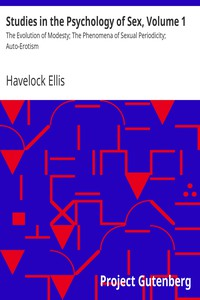

# Studies in the Psychology of Sex, Volume 1: The Evolution of Modesty; The Phenomena of Sexual Periodicity; Auto-Erotism <kbd>13610</kbd>

## Authors

 - Ellis, Havelock <small>(1859 - 1939)</small>

## Subjects

 - Sex
 - Sex (Psychology)

## Download

 - https://www.gutenberg.org/files/13610/13610.txt
 - https://www.gutenberg.org/files/13610/13610-8.zip
 - https://www.gutenberg.org/cache/epub/13610/pg13610.cover.small.jpg
 - https://www.gutenberg.org/files/13610/13610-h/13610-h.htm
 - https://www.gutenberg.org/ebooks/13610.html.images
 - https://www.gutenberg.org/files/13610/13610-8.txt
 - https://www.gutenberg.org/ebooks/13610.txt.utf-8
 - https://www.gutenberg.org/ebooks/13610.epub.images
 - https://www.gutenberg.org/ebooks/13610.rdf
 - https://www.gutenberg.org/ebooks/13610.kindle.images

## Book Shelves

 - Banned Books from Anne Haight's list
 - Psychology
