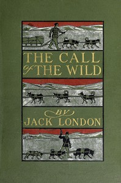

# The Call of the Wild <kbd>215</kbd>

## Authors

 - London, Jack <small>(1876 - 1916)</small>

## Subjects

 - Adventure stories
 - Animal welfare -- Fiction
 - Dogs -- Fiction
 - Feral dogs -- Fiction
 - Klondike River Valley (Yukon) -- Fiction
 - Nature stories
 - Pet theft -- Fiction
 - Sled dogs -- Fiction

## Download

 - https://www.gutenberg.org/files/215/215-h.zip
 - https://www.gutenberg.org/files/215/215-0.txt
 - https://www.gutenberg.org/files/215/215-h/215-h.htm
 - https://www.gutenberg.org/cache/epub/215/pg215.cover.small.jpg
 - https://www.gutenberg.org/files/215/215.txt
 - https://www.gutenberg.org/ebooks/215.html.images
 - https://www.gutenberg.org/ebooks/215.kindle.images
 - https://www.gutenberg.org/ebooks/215.rdf
 - https://www.gutenberg.org/ebooks/215.epub.images

## Book Shelves

 - Adventure
 - Animals-Domestic
 - Banned Books List from the American Library Association
 - Banned Books from Anne Haight's list
 - Best Books Ever Listings
 - Movie Books
