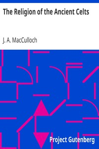

# The Religion of the Ancient Celts <kbd>14672</kbd>

## Authors

 - MacCulloch, J. A. (John Arnott) <small>(1868 - 1950)</small>

## Subjects

 - Celts -- Religion
 - Mythology, Celtic

## Download

 - https://www.gutenberg.org/cache/epub/14672/pg14672.cover.small.jpg
 - https://www.gutenberg.org/files/14672/14672.zip
 - https://www.gutenberg.org/files/14672/14672-h/14672-h.htm
 - https://www.gutenberg.org/files/14672/14672.txt
 - https://www.gutenberg.org/files/14672/14672-8.txt
 - https://www.gutenberg.org/ebooks/14672.html.images
 - https://www.gutenberg.org/ebooks/14672.txt.utf-8
 - https://www.gutenberg.org/ebooks/14672.rdf
 - https://www.gutenberg.org/ebooks/14672.epub.images
 - https://www.gutenberg.org/ebooks/14672.kindle.images

## Book Shelves

 - Paganism
