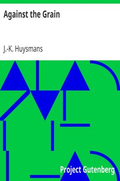

# Against the Grain <kbd>12341</kbd>

## Authors

 - Huysmans, J.-K. (Joris-Karl) <small>(1848 - 1907)</small>

## Subjects

 - Aesthetics -- Fiction
 - French fiction -- Translations into English

## Download

 - https://www.gutenberg.org/files/12341/12341.txt
 - https://www.gutenberg.org/cache/epub/12341/pg12341.cover.medium.jpg
 - https://www.gutenberg.org/files/12341/12341-h/12341-h.htm
 - https://www.gutenberg.org/files/12341/12341-h.zip
 - https://www.gutenberg.org/ebooks/12341.html.images
 - https://www.gutenberg.org/ebooks/12341.txt.utf-8
 - https://www.gutenberg.org/ebooks/12341.epub.images
 - https://www.gutenberg.org/ebooks/12341.kindle.images
 - https://www.gutenberg.org/ebooks/12341.rdf

## Book Shelves

