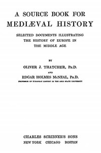

# A Source Book for Mediæval History: Selected Documents illustrating the History of Europe in the Middle Age <kbd>42707</kbd>

## Authors

 - McNeal, Edgar Holmes <small>(1874 - 1955)</small>
 - Thatcher, Oliver J. (Oliver Joseph) <small>(1857 - 1937)</small>

## Subjects

 - Europe -- History -- 476-1492 -- Sources
 - Middle Ages -- Sources

## Download

 - https://www.gutenberg.org/files/42707/42707-h/42707-h.htm
 - https://www.gutenberg.org/files/42707/42707-8.zip
 - https://www.gutenberg.org/cache/epub/42707/pg42707.cover.small.jpg
 - https://www.gutenberg.org/files/42707/42707.txt
 - https://www.gutenberg.org/files/42707/42707-8.txt
 - https://www.gutenberg.org/ebooks/42707.rdf
 - https://www.gutenberg.org/ebooks/42707.kindle.images
 - https://www.gutenberg.org/ebooks/42707.txt.utf-8
 - https://www.gutenberg.org/ebooks/42707.epub.images

## Book Shelves

