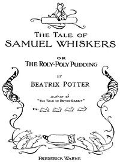

# The Tale of Samuel Whiskers; Or, The Roly-Poly Pudding <kbd>15575</kbd>

## Authors

 - Potter, Beatrix <small>(1866 - 1943)</small>

## Subjects

 - Cats -- Juvenile fiction
 - Children's stories, English
 - Rats -- Juvenile fiction

## Download

 - https://www.gutenberg.org/cache/epub/15575/pg15575.cover.small.jpg
 - https://www.gutenberg.org/files/15575/15575.txt
 - https://www.gutenberg.org/files/15575/15575-h.zip
 - https://www.gutenberg.org/files/15575/15575-h/15575-h.htm
 - https://www.gutenberg.org/ebooks/15575.html.images
 - https://www.gutenberg.org/ebooks/15575.txt.utf-8
 - https://www.gutenberg.org/ebooks/15575.epub.images
 - https://www.gutenberg.org/ebooks/15575.kindle.images
 - https://www.gutenberg.org/ebooks/15575.rdf

## Book Shelves

 - Children's Picture Books
