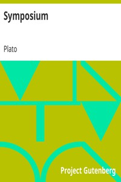

# Symposium <kbd>1600</kbd>

## Authors

 - Plato <small>(-428 - -348)</small>

## Subjects

 - Classical literature
 - Love -- Early works to 1800
 - Philosophy, Ancient
 - Socrates, 470 BC-399 BC

## Download

 - https://www.gutenberg.org/files/1600/1600-h.zip
 - https://www.gutenberg.org/cache/epub/1600/pg1600.cover.medium.jpg
 - https://www.gutenberg.org/files/1600/1600.txt
 - https://www.gutenberg.org/ebooks/1600.html.images
 - https://www.gutenberg.org/files/1600/1600-h/1600-h.htm
 - https://www.gutenberg.org/ebooks/1600.rdf
 - https://www.gutenberg.org/ebooks/1600.epub.images
 - https://www.gutenberg.org/ebooks/1600.kindle.images
 - https://www.gutenberg.org/ebooks/1600.txt.utf-8

## Book Shelves

