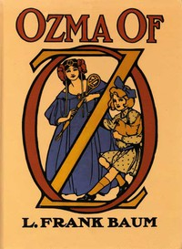

# Ozma of Oz: A Record of Her Adventures with Dorothy Gale of Kansas, the Yellow Hen, the Scarecrow, the Tin Woodman, Tiktok, the Cowardly Lion, and the Hungry Tiger; Besides Other Good People too Numerous to Mention Faithfully Recorded Herein <kbd>33361</kbd>

## Authors

 - Baum, L. Frank (Lyman Frank) <small>(1856 - 1919)</small>

## Subjects

 - Cowardly Lion (Fictitious character) -- Juvenile fiction
 - Fantasy literature
 - Gale, Dorothy (Fictitious character) -- Juvenile fiction
 - Hens -- Juvenile fiction
 - Kings and rulers -- Juvenile fiction
 - Magic -- Juvenile fiction
 - Oz (Imaginary place) -- Juvenile fiction
 - Physicians -- Juvenile fiction
 - Princess Ozma (Fictitious character) -- Juvenile fiction
 - Scarecrow (Fictitious character from Baum) -- Juvenile fiction
 - Steamboats -- Juvenile fiction
 - Tin Woodman (Fictitious character) -- Juvenile fiction
 - Uncles -- Juvenile fiction
 - Vacations -- Juvenile fiction
 - Voyages and travels -- Juvenile fiction

## Download

 - https://www.gutenberg.org/files/33361/33361-h.zip
 - https://www.gutenberg.org/files/33361/33361-8.txt
 - https://www.gutenberg.org/files/33361/33361.txt
 - https://www.gutenberg.org/cache/epub/33361/pg33361.cover.medium.jpg
 - https://www.gutenberg.org/files/33361/33361-h/33361-h.htm
 - https://www.gutenberg.org/ebooks/33361.html.images
 - https://www.gutenberg.org/ebooks/33361.txt.utf-8
 - https://www.gutenberg.org/ebooks/33361.epub.images
 - https://www.gutenberg.org/ebooks/33361.rdf
 - https://www.gutenberg.org/ebooks/33361.kindle.images

## Book Shelves

