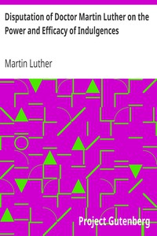

# Disputation of Doctor Martin Luther on the Power and Efficacy of Indulgences <kbd>274</kbd>

## Authors

 - Luther, Martin <small>(1483 - 1546)</small>

## Subjects

 - Indulgences
 - Reformation -- Germany -- Sources

## Download

 - https://www.gutenberg.org/files/274/274.txt
 - https://www.gutenberg.org/cache/epub/274/pg274.cover.medium.jpg
 - https://www.gutenberg.org/ebooks/274.kindle.images
 - https://www.gutenberg.org/ebooks/274.html.images
 - https://www.gutenberg.org/ebooks/274.txt.utf-8
 - https://www.gutenberg.org/ebooks/274.rdf
 - https://www.gutenberg.org/ebooks/274.epub.images

## Book Shelves

 - Banned Books from Anne Haight's list
 - Christianity
 - Harvard Classics
