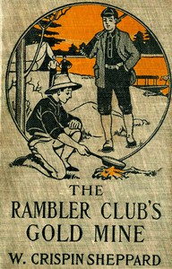

# The Rambler Club's Gold Mine <kbd>67654</kbd>

## Authors

 - Sheppard, W. Crispin (William Crispin) <small>(1871 - null)</small>

## Subjects

 - Adventure stories
 - Boys -- Societies and clubs -- Juvenile fiction
 - Gold mines and mining -- Juvenile fiction
 - Washington (State) -- Juvenile fiction

## Download

 - https://www.gutenberg.org/ebooks/67654.epub.images
 - https://www.gutenberg.org/ebooks/67654.kindle.images
 - https://www.gutenberg.org/ebooks/67654.txt.utf-8
 - https://www.gutenberg.org/cache/epub/67654/pg67654.cover.medium.jpg
 - https://www.gutenberg.org/ebooks/67654.rdf
 - https://www.gutenberg.org/files/67654/67654-0.zip
 - https://www.gutenberg.org/files/67654/67654-0.txt
 - https://www.gutenberg.org/files/67654/67654-h.zip
 - https://www.gutenberg.org/files/67654/67654-h/67654-h.htm

## Book Shelves

