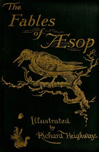

# The Fables of Aesop: Selected, Told Anew, and Their History Traced <kbd>28</kbd>

## Authors

 - Aesop <small>(null - null)</small>

## Subjects

 - Aesop's fables -- Adaptations
 - Fables, Greek -- Adaptations

## Download

 - https://www.gutenberg.org/files/28/28-0.zip
 - https://www.gutenberg.org/files/28/28-h.zip
 - https://www.gutenberg.org/cache/epub/28/pg28.cover.small.jpg
 - https://www.gutenberg.org/ebooks/28.html.images
 - https://www.gutenberg.org/files/28/28-0.txt
 - https://www.gutenberg.org/ebooks/28.kindle.images
 - https://www.gutenberg.org/ebooks/28.txt.utf-8
 - https://www.gutenberg.org/ebooks/28.rdf
 - https://www.gutenberg.org/ebooks/28.epub.images

## Book Shelves

 - Harvard Classics
