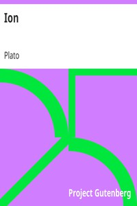

# Ion <kbd>1635</kbd>

## Authors

 - Plato <small>(-428 - -348)</small>

## Subjects

 - Aesthetics, Ancient
 - Classical literature
 - Homer. Iliad
 - Poetics -- History -- To 1500

## Download

 - https://www.gutenberg.org/cache/epub/1635/pg1635.cover.small.jpg
 - https://www.gutenberg.org/files/1635/1635.txt
 - https://www.gutenberg.org/files/1635/1635-h/1635-h.htm
 - https://www.gutenberg.org/ebooks/1635.html.images
 - https://www.gutenberg.org/ebooks/1635.rdf
 - https://www.gutenberg.org/ebooks/1635.epub.images
 - https://www.gutenberg.org/ebooks/1635.kindle.images
 - https://www.gutenberg.org/ebooks/1635.txt.utf-8

## Book Shelves

 - Philosophy
