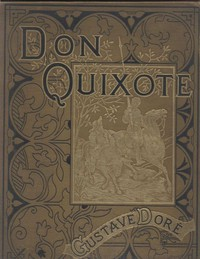

# The History of Don Quixote, Volume 2, Complete <kbd>5946</kbd>

## Authors

 - Cervantes Saavedra, Miguel de <small>(1547 - 1616)</small>

## Subjects

 - Knights and knighthood -- Spain -- Fiction
 - Picaresque literature
 - Romances
 - Spain -- Social life and customs -- 16th century -- Fiction

## Download

 - https://www.gutenberg.org/files/5946/5946-h.zip
 - https://www.gutenberg.org/ebooks/5946.html.images
 - https://www.gutenberg.org/files/5946/5946-0.txt
 - https://www.gutenberg.org/ebooks/5946.txt.utf-8
 - https://www.gutenberg.org/cache/epub/5946/pg5946.cover.small.jpg
 - https://www.gutenberg.org/ebooks/5946.kindle.images
 - https://www.gutenberg.org/ebooks/5946.rdf
 - https://www.gutenberg.org/ebooks/5946.epub.images

## Book Shelves

 - 6 Best Loved Spanish Literary Classics
 - Banned Books from Anne Haight's list
 - Best Books Ever Listings
