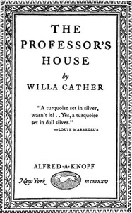

# The Professor's House <kbd>65465</kbd>

## Authors

 - Cather, Willa <small>(1873 - 1947)</small>

## Subjects

 - College teachers -- Fiction
 - Frame-stories
 - Middle-aged men -- Fiction
 - Midlife crisis -- Fiction
 - Psychological fiction
 - Teacher-student relationships -- Fiction

## Download

 - https://www.gutenberg.org/files/65465/65465-h.zip
 - https://www.gutenberg.org/cache/epub/65465/pg65465.cover.medium.jpg
 - https://www.gutenberg.org/files/65465/65465-0.txt
 - https://www.gutenberg.org/ebooks/65465.html.images
 - https://www.gutenberg.org/ebooks/65465.kindle.images
 - https://www.gutenberg.org/files/65465/65465-h/65465-h.htm
 - https://www.gutenberg.org/ebooks/65465.rdf
 - https://www.gutenberg.org/ebooks/65465.epub.images

## Book Shelves

