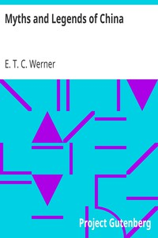

# Myths and Legends of China <kbd>15250</kbd>

## Authors

 - Werner, E. T. C. (Edward Theodore Chalmers) <small>(1864 - 1954)</small>

## Subjects

 - Legends -- China
 - Mythology, Chinese
 - Tales -- China

## Download

 - https://www.gutenberg.org/files/15250/15250.zip
 - https://www.gutenberg.org/cache/epub/15250/pg15250.cover.medium.jpg
 - https://www.gutenberg.org/files/15250/15250-h.zip
 - https://www.gutenberg.org/ebooks/15250.html.images
 - https://www.gutenberg.org/files/15250/15250-h/15250-h.htm
 - https://www.gutenberg.org/ebooks/15250.txt.utf-8
 - https://www.gutenberg.org/files/15250/15250-8.txt
 - https://www.gutenberg.org/ebooks/15250.epub.images
 - https://www.gutenberg.org/ebooks/15250.rdf
 - https://www.gutenberg.org/ebooks/15250.kindle.images

## Book Shelves

 - Folklore
 - Mythology
