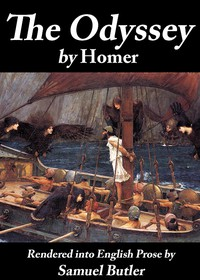

# The Odyssey: Rendered into English prose for the use of those who cannot read the original <kbd>1727</kbd>

## Authors

 - Homer <small>(-750 - -650)</small>

## Subjects

 - Epic poetry, Greek -- Translations into English
 - Homer -- Translations into English
 - Odysseus, King of Ithaca (Mythological character)

## Download

 - https://www.gutenberg.org/cache/epub/1727/pg1727.cover.medium.jpg
 - https://www.gutenberg.org/files/1727/1727-0.zip
 - https://www.gutenberg.org/files/1727/1727-h/1727-h.htm
 - https://www.gutenberg.org/files/1727/1727-0.txt
 - https://www.gutenberg.org/ebooks/1727.txt.utf-8
 - https://www.gutenberg.org/ebooks/1727.rdf
 - https://www.gutenberg.org/ebooks/1727.epub.images
 - https://www.gutenberg.org/ebooks/1727.kindle.images

## Book Shelves

 - Classical Antiquity
 - Harvard Classics
