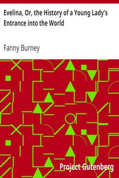

# Evelina, Or, the History of a Young Lady's Entrance into the World <kbd>6053</kbd>

## Authors

 - Burney, Fanny <small>(1752 - 1840)</small>

## Subjects

 - Bildungsromans
 - Debutantes -- Fiction
 - Epistolary fiction
 - Humorous stories
 - London (England) -- Fiction
 - Love stories
 - Satire
 - Socialites -- Fiction
 - Young women -- Fiction

## Download

 - https://www.gutenberg.org/files/6053/6053-h.zip
 - https://www.gutenberg.org/files/6053/6053-h/6053-h.htm
 - https://www.gutenberg.org/cache/epub/6053/pg6053.cover.medium.jpg
 - https://www.gutenberg.org/files/6053/6053.txt
 - https://www.gutenberg.org/ebooks/6053.html.images
 - https://www.gutenberg.org/ebooks/6053.kindle.images
 - https://www.gutenberg.org/ebooks/6053.rdf
 - https://www.gutenberg.org/ebooks/6053.epub.images
 - https://www.gutenberg.org/ebooks/6053.txt.utf-8

## Book Shelves

