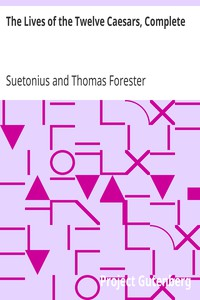

# The Lives of the Twelve Caesars, Complete <kbd>6400</kbd>

## Authors

 - Suetonius <small>(null - null)</small>

## Subjects

 - Emperors -- Rome -- Biography -- Early works to 1800
 - Rome -- History -- Empire, 30 B.C.-284 A.D.

## Download

 - https://www.gutenberg.org/files/6400/6400-h.zip
 - https://www.gutenberg.org/cache/epub/6400/pg6400.cover.small.jpg
 - https://www.gutenberg.org/files/6400/6400-0.txt
 - https://www.gutenberg.org/files/6400/6400.txt
 - https://www.gutenberg.org/ebooks/6400.html.images
 - https://www.gutenberg.org/files/6400/6400-h/6400-h.htm
 - https://www.gutenberg.org/ebooks/6400.kindle.images
 - https://www.gutenberg.org/ebooks/6400.rdf
 - https://www.gutenberg.org/ebooks/6400.epub.images

## Book Shelves

