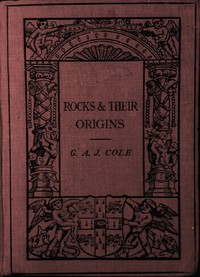

# Rocks and Their Origins <kbd>67685</kbd>

## Authors

 - Cole, Grenville A. J. (Grenville Arthur James) <small>(1859 - 1924)</small>

## Subjects

 - Rocks

## Download

 - https://www.gutenberg.org/ebooks/67685.kindle.images
 - https://www.gutenberg.org/ebooks/67685.epub.images
 - https://www.gutenberg.org/ebooks/67685.txt.utf-8
 - https://www.gutenberg.org/ebooks/67685.html.images
 - https://www.gutenberg.org/cache/epub/67685/pg67685.cover.small.jpg
 - https://www.gutenberg.org/ebooks/67685.rdf
 - https://www.gutenberg.org/files/67685/67685-0.zip
 - https://www.gutenberg.org/files/67685/67685-0.txt

## Book Shelves

