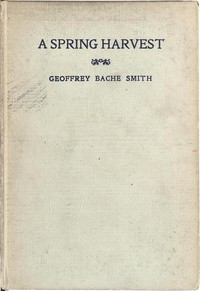

# A Spring Harvest <kbd>48371</kbd>

## Authors

 - Smith, Geoffrey Bache <small>(1894 - 1916)</small>

## Subjects

 - English poetry -- 20th century
 - World War, 1914-1918 -- Poetry

## Download

 - https://www.gutenberg.org/files/48371/48371.zip
 - https://www.gutenberg.org/files/48371/48371-h.zip
 - https://www.gutenberg.org/files/48371/48371-rst/48371-rst.rst
 - https://www.gutenberg.org/files/48371/48371-8.zip
 - https://www.gutenberg.org/cache/epub/48371/pg48371.cover.medium.jpg
 - https://www.gutenberg.org/files/48371/48371-0.zip
 - https://www.gutenberg.org/ebooks/48371.html.images
 - https://www.gutenberg.org/files/48371/48371.txt
 - https://www.gutenberg.org/ebooks/48371.epub.images
 - https://www.gutenberg.org/ebooks/48371.pdf.images
 - https://www.gutenberg.org/ebooks/48371.rdf
 - https://www.gutenberg.org/ebooks/48371.kindle.images

## Book Shelves

