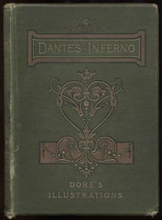

# An Index of The Divine Comedy by Dante <kbd>8800</kbd>

## Authors

 - Dante Alighieri <small>(1265 - 1321)</small>

## Subjects

 - Epic poetry, Italian -- Translations into English
 - Italian poetry -- To 1400 -- Translations into English

## Download

 - https://www.gutenberg.org/files/8800/8800-h.zip
 - https://www.gutenberg.org/cache/epub/8800/pg8800.cover.medium.jpg
 - https://www.gutenberg.org/files/8800/8800.zip
 - https://www.gutenberg.org/ebooks/8800.html.images
 - https://www.gutenberg.org/ebooks/8800.rdf
 - https://www.gutenberg.org/ebooks/8800.kindle.images
 - https://www.gutenberg.org/ebooks/8800.epub.images
 - https://www.gutenberg.org/ebooks/8800.txt.utf-8

## Book Shelves

 - Best Books Ever Listings
 - Italy
