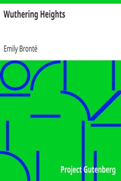

# Wuthering Heights <kbd>768</kbd>

## Authors

 - Brontë, Emily <small>(1818 - 1848)</small>

## Subjects

 - Domestic fiction
 - Foundlings -- Fiction
 - Heathcliff (Fictitious character : Brontë) -- Fiction
 - Love stories
 - Psychological fiction
 - Rejection (Psychology) -- Fiction
 - Revenge -- Fiction
 - Rural families -- Fiction
 - Triangles (Interpersonal relations) -- Fiction
 - Yorkshire (England) -- Fiction

## Download

 - https://www.gutenberg.org/ebooks/768.html.images
 - https://www.gutenberg.org/cache/epub/768/pg768.cover.medium.jpg
 - https://www.gutenberg.org/files/768/768-h.zip
 - https://www.gutenberg.org/ebooks/768.txt.utf-8
 - https://www.gutenberg.org/files/768/768-0.txt
 - https://www.gutenberg.org/ebooks/768.kindle.images
 - https://www.gutenberg.org/ebooks/768.rdf
 - https://www.gutenberg.org/ebooks/768.epub.images

## Book Shelves

 - Best Books Ever Listings
 - Gothic Fiction
 - Movie Books
