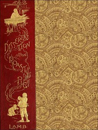

# A Dissertation upon Roast Pig <kbd>43566</kbd>

## Authors

 - Lamb, Charles <small>(1775 - 1834)</small>

## Subjects

 - Roasting (Cooking)
 - Swine

## Download

 - https://www.gutenberg.org/files/43566/43566-8.zip
 - https://www.gutenberg.org/files/43566/43566-8.txt
 - https://www.gutenberg.org/files/43566/43566.txt
 - https://www.gutenberg.org/cache/epub/43566/pg43566.cover.medium.jpg
 - https://www.gutenberg.org/ebooks/43566.html.images
 - https://www.gutenberg.org/files/43566/43566-h/43566-h.htm
 - https://www.gutenberg.org/ebooks/43566.rdf
 - https://www.gutenberg.org/ebooks/43566.kindle.images
 - https://www.gutenberg.org/ebooks/43566.txt.utf-8
 - https://www.gutenberg.org/ebooks/43566.epub.images

## Book Shelves

