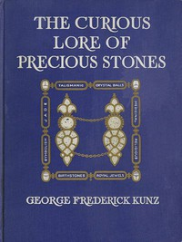

# The Curious Lore of Precious Stones: Being a description of their sentiments and folk lore, superstitions, symbolism, mysticism, use in medicine, protection, prevention, religion, and divination. Crystal gazing, birth-stones, lucky stones and talismans, astral, zodiacal, and planetary <kbd>57978</kbd>

## Authors

 - Kunz, George Frederick <small>(1856 - 1932)</small>

## Subjects

 - Gems
 - Gems -- Folklore

## Download

 - https://www.gutenberg.org/files/57978/57978-h.zip
 - https://www.gutenberg.org/cache/epub/57978/pg57978.cover.small.jpg
 - https://www.gutenberg.org/files/57978/57978-0.zip
 - https://www.gutenberg.org/files/57978/57978-h/57978-h.htm
 - https://www.gutenberg.org/ebooks/57978.html.images
 - https://www.gutenberg.org/ebooks/57978.rdf
 - https://www.gutenberg.org/ebooks/57978.epub.images
 - https://www.gutenberg.org/ebooks/57978.kindle.images

## Book Shelves

