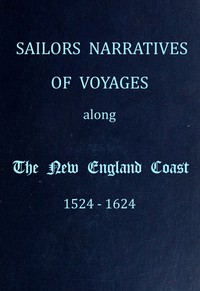

# Sailors Narratives of Voyages Along the New England Coast, 1524-1624 <kbd>67623</kbd>

## Authors

## Subjects

 - America -- Discovery and exploration -- British -- Early works to 1800
 - America -- Early accounts to 1600
 - New England -- Description and travel -- Early works to 1800

## Download

 - https://www.gutenberg.org/ebooks/67623.rdf
 - https://www.gutenberg.org/ebooks/67623.txt.utf-8
 - https://www.gutenberg.org/ebooks/67623.epub.images
 - https://www.gutenberg.org/cache/epub/67623/pg67623.cover.small.jpg
 - https://www.gutenberg.org/ebooks/67623.html.images
 - https://www.gutenberg.org/ebooks/67623.kindle.images
 - https://www.gutenberg.org/files/67623/67623-h.zip
 - https://www.gutenberg.org/files/67623/67623-0.txt

## Book Shelves

