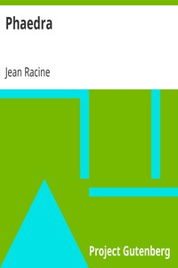

# Phaedra <kbd>1977</kbd>

## Authors

 - Racine, Jean <small>(1639 - 1699)</small>

## Subjects

 - Phaedra (Greek mythology) -- Drama
 - Tragedies

## Download

 - https://www.gutenberg.org/files/1977/1977-h.zip
 - https://www.gutenberg.org/files/1977/1977-h/1977-h.htm
 - https://www.gutenberg.org/files/1977/1977.zip
 - https://www.gutenberg.org/cache/epub/1977/pg1977.cover.medium.jpg
 - https://www.gutenberg.org/ebooks/1977.html.images
 - https://www.gutenberg.org/ebooks/1977.rdf
 - https://www.gutenberg.org/ebooks/1977.epub.images
 - https://www.gutenberg.org/ebooks/1977.kindle.images
 - https://www.gutenberg.org/ebooks/1977.txt.utf-8

## Book Shelves

 - Harvard Classics
