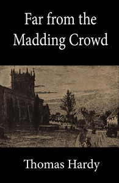

# Far from the Madding Crowd <kbd>107</kbd>

## Authors

 - Hardy, Thomas <small>(1840 - 1928)</small>

## Subjects

 - Didactic fiction
 - Farm life -- Fiction
 - Love stories
 - Pastoral fiction
 - Triangles (Interpersonal relations) -- Fiction
 - Wessex (England) -- Fiction
 - Women farmers -- Fiction

## Download

 - https://www.gutenberg.org/files/107/107-h.zip
 - https://www.gutenberg.org/files/107/107-0.zip
 - https://www.gutenberg.org/cache/epub/107/pg107.cover.medium.jpg
 - https://www.gutenberg.org/ebooks/107.html.images
 - https://www.gutenberg.org/ebooks/107.kindle.images
 - https://www.gutenberg.org/ebooks/107.rdf
 - https://www.gutenberg.org/ebooks/107.epub.images

## Book Shelves

