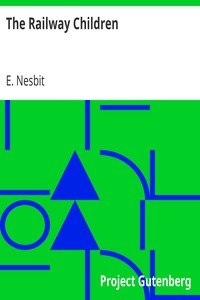

# The Railway Children <kbd>1874</kbd>

## Authors

 - Nesbit, E. (Edith) <small>(1858 - 1924)</small>

## Subjects

 - Brothers and sisters -- Fiction
 - Country life -- England -- Fiction
 - England -- Fiction
 - Family life -- Fiction
 - Railroads -- Fiction

## Download

 - https://www.gutenberg.org/cache/epub/1874/pg1874.cover.small.jpg
 - https://www.gutenberg.org/files/1874/1874.zip
 - https://www.gutenberg.org/files/1874/1874-0.zip
 - https://www.gutenberg.org/files/1874/1874-h/1874-h.htm
 - https://www.gutenberg.org/ebooks/1874.html.images
 - https://www.gutenberg.org/ebooks/1874.epub.images
 - https://www.gutenberg.org/ebooks/1874.rdf
 - https://www.gutenberg.org/ebooks/1874.kindle.images

## Book Shelves

 - Children's Fiction
 - Children's Literature
