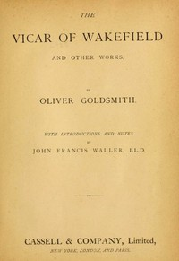

# The Vicar of Wakefield <kbd>2667</kbd>

## Authors

 - Goldsmith, Oliver <small>(null - 1774)</small>

## Subjects

 - Abduction -- Fiction
 - Children of clergy -- Fiction
 - Clergy -- Fiction
 - Domestic fiction
 - England -- Fiction
 - Poor families -- Fiction
 - Prisoners -- Fiction

## Download

 - https://www.gutenberg.org/ebooks/2667.txt.utf-8
 - https://www.gutenberg.org/files/2667/2667-h.zip
 - https://www.gutenberg.org/files/2667/2667-0.txt
 - https://www.gutenberg.org/cache/epub/2667/pg2667.cover.small.jpg
 - https://www.gutenberg.org/ebooks/2667.html.images
 - https://www.gutenberg.org/ebooks/2667.rdf
 - https://www.gutenberg.org/ebooks/2667.epub.images
 - https://www.gutenberg.org/ebooks/2667.kindle.images

## Book Shelves

