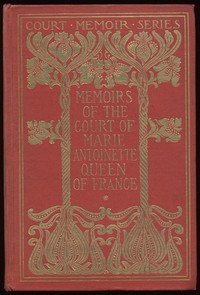

# Memoirs of the Court of Marie Antoinette, Queen of France, Complete: Being the Historic Memoirs of Madam Campan, First Lady in Waiting to the Queen <kbd>3891</kbd>

## Authors

 - Campan, Mme. (Jeanne-Louise-Henriette) <small>(1752 - 1822)</small>

## Subjects

 - France -- Court and courtiers
 - Marie Antoinette, Queen, consort of Louis XVI, King of France, 1755-1793

## Download

 - https://www.gutenberg.org/files/3891/3891-h.zip
 - https://www.gutenberg.org/files/3891/3891.txt
 - https://www.gutenberg.org/files/3891/3891-0.zip
 - https://www.gutenberg.org/cache/epub/3891/pg3891.cover.small.jpg
 - https://www.gutenberg.org/ebooks/3891.html.images
 - https://www.gutenberg.org/files/3891/3891-0.txt
 - https://www.gutenberg.org/ebooks/3891.epub.images
 - https://www.gutenberg.org/ebooks/3891.kindle.images
 - https://www.gutenberg.org/ebooks/3891.rdf

## Book Shelves

