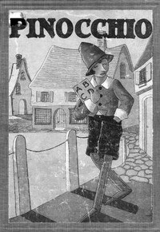

# Pinocchio: The Tale of a Puppet <kbd>16865</kbd>

## Authors

 - Collodi, Carlo <small>(1826 - 1890)</small>

## Subjects

 - Fairy tales
 - Pinocchio (Fictitious character) -- Juvenile fiction
 - Puppets -- Juvenile fiction

## Download

 - https://www.gutenberg.org/files/16865/16865.zip
 - https://www.gutenberg.org/files/16865/16865-h.zip
 - https://www.gutenberg.org/cache/epub/16865/pg16865.cover.medium.jpg
 - https://www.gutenberg.org/ebooks/16865.html.images
 - https://www.gutenberg.org/files/16865/16865-8.txt
 - https://www.gutenberg.org/ebooks/16865.txt.utf-8
 - https://www.gutenberg.org/ebooks/16865.rdf
 - https://www.gutenberg.org/ebooks/16865.epub.images
 - https://www.gutenberg.org/ebooks/16865.kindle.images

## Book Shelves

