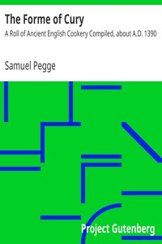

# The Forme of Cury: A Roll of Ancient English Cookery Compiled, about A.D. 1390 <kbd>8102</kbd>

## Authors

 - Pegge, Samuel <small>(1704 - 1796)</small>

## Subjects

 - Cooking, English -- Early works to 1800

## Download

 - https://www.gutenberg.org/cache/epub/8102/pg8102.cover.medium.jpg
 - https://www.gutenberg.org/files/8102/8102-8.txt
 - https://www.gutenberg.org/ebooks/8102.html.images
 - https://www.gutenberg.org/ebooks/8102.rdf
 - https://www.gutenberg.org/ebooks/8102.kindle.images
 - https://www.gutenberg.org/ebooks/8102.epub.images
 - https://www.gutenberg.org/ebooks/8102.txt.utf-8

## Book Shelves

 - Cookbooks and Cooking
