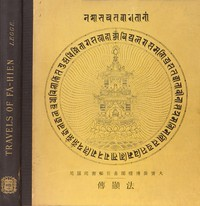

# A Record of Buddhistic Kingdoms: Being an account by the Chinese monk Fa-hsien of travels in India and Ceylon (A.D. 399-414) in search of the Buddhist books of discipline <kbd>2124</kbd>

## Authors

 - Faxian <small>(null - null)</small>

## Subjects

 - Asia -- Description and travel -- Early works to 1800
 - Buddhism -- Early works to 1800
 - Buddhist pilgrims and pilgrimages -- India -- Early works to 1800

## Download

 - https://www.gutenberg.org/files/2124/2124-h.zip
 - https://www.gutenberg.org/files/2124/2124-0.zip
 - https://www.gutenberg.org/cache/epub/2124/pg2124.cover.small.jpg
 - https://www.gutenberg.org/ebooks/2124.html.images
 - https://www.gutenberg.org/ebooks/2124.rdf
 - https://www.gutenberg.org/ebooks/2124.epub.images
 - https://www.gutenberg.org/ebooks/2124.kindle.images

## Book Shelves

 - Buddhism
 - India
