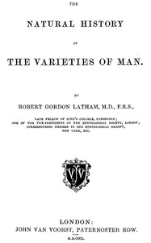

# The Natural History of the Varieties of Man <kbd>47390</kbd>

## Authors

 - Latham, R. G. (Robert Gordon) <small>(1812 - 1888)</small>

## Subjects

 - Ethnology

## Download

 - https://www.gutenberg.org/files/47390/47390-8.txt
 - https://www.gutenberg.org/files/47390/47390-0.zip
 - https://www.gutenberg.org/cache/epub/47390/pg47390.cover.medium.jpg
 - https://www.gutenberg.org/files/47390/47390-h/47390-h.htm
 - https://www.gutenberg.org/ebooks/47390.html.images
 - https://www.gutenberg.org/ebooks/47390.epub.images
 - https://www.gutenberg.org/ebooks/47390.rdf
 - https://www.gutenberg.org/ebooks/47390.kindle.images

## Book Shelves

